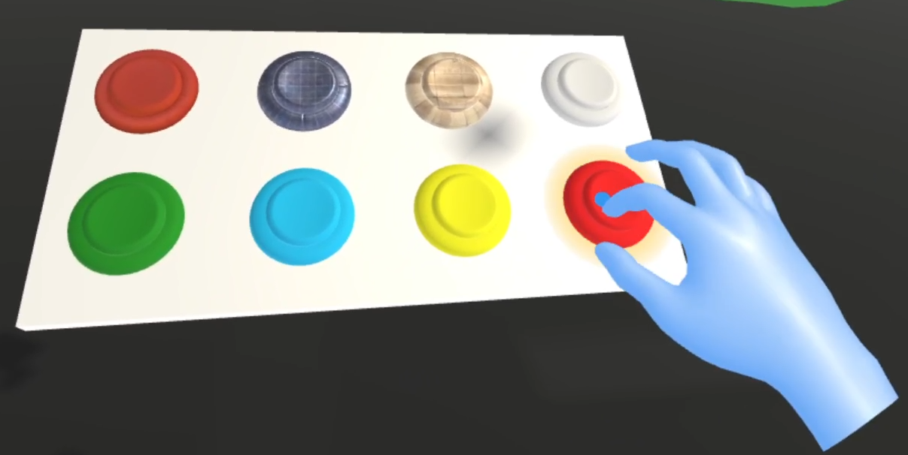
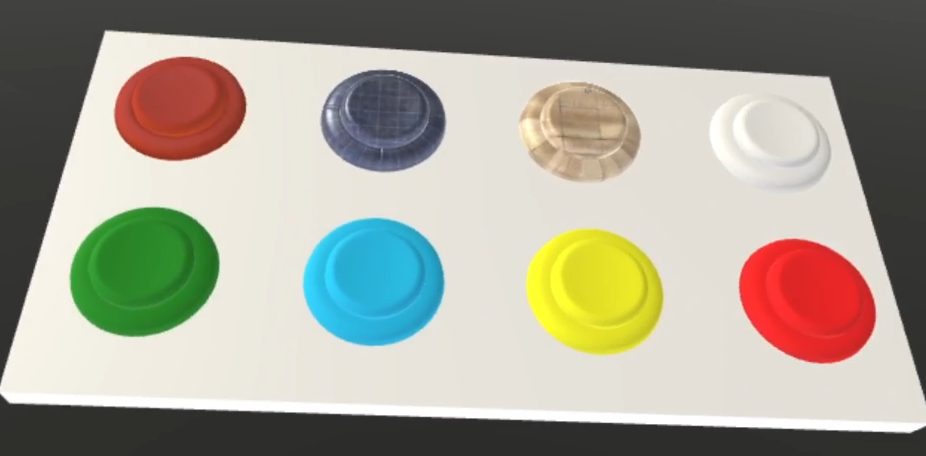
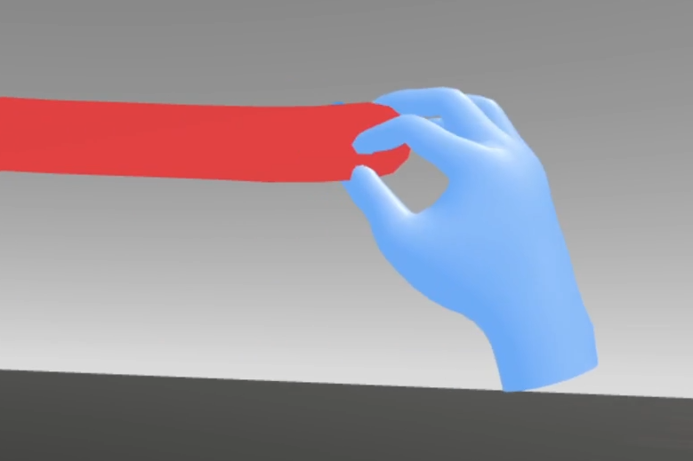
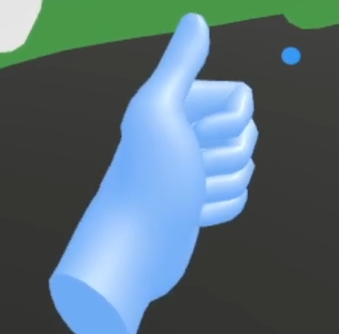
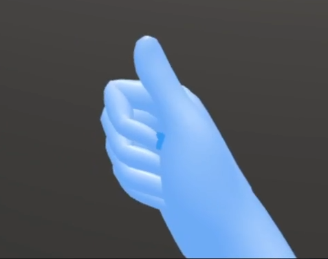

## Concept

I planned to create a VR painting tool that enables users paint in 3D space. They can view their works in different perspectives to explore more possibilities in painting.

Most of the VR project are using VR controllers. But I think hand tracking may be a more convenient and more intuitive way to interact in VR world.

## Input Mechanism

I combined hand tracking and gesture recognition as input mechanism. Since that oculus only supports pinching, I create another two gestures to break the limit. Local position of each bones of the customized gestures are stored in a list. When recognizing a gesture, local positon of each bones of current gesture will be compared with stored data.

1. Hand Tracking

By tracking the fingertips (blue point in the figure), users are allowed to press on the buttons in the virual world directly.

2. Control Panel

There are eight buttons on the control panel currently representing clear all paintings, change material to metal, change material to wood, change material to default, change color to green, change color to blue, change color to yellow and change color to red.

3. Pinching

The width of lines are controlled by pinch strenth. But oculus quest cannot recognize pinching strengh precisely.

4. Thumb Up

Users can use "left thumb up" to rotate the camera and use "right thumb up" to move the camera.

5. Victory

Users can use "victory" to show or hide the control panel.

## Video

[VRDraw Video](https://youtu.be/rcc84lPHZ1Y)

## Repository
[VRDraw Repository](https://github.com/Vakarian15/Unity-VRDraw)

## Future Works

* Add more materials.

* Create a color wheel to enable users to pick more colors.

* Create more brushes.

## References

https://www.youtube.com/watch?v=mke65i0MFjw&t

https://www.youtube.com/watch?v=lBzwUKQ3tbw
